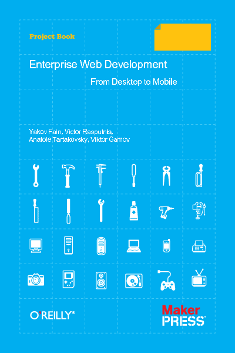

== Enterprise Web Development: From Desktop to Mobile

This is a home of the new book (work in progress) «Enterprise Web
Development. From Desktop to Mobile». There are four co-authors of this
book: Yakov Fain, Victor Rasputnis, Viktor Gamov, and Anatole
Tartakovsky. The book is released under a Creative Commons
Attribution-NonCommercial-ShareAlike 3.0 Unported
http://creativecommons.org/licenses/by-nc-sa/3.0/[license] meaning you
can both get a copy of the book for free or help to further improve it.
This book will be printed and available for purchase via
http://oreilly.com/[O'Reilly Media]. Readers will have an option of
purchasing this book in a number of digital formats.

The repository for code samples accompanying the book is located at https://github.com/Farata/EnterpriseWebBook_sources.

The screencasts mentioned in the book are located at http://www.youtube.com/trainingatfarata.

