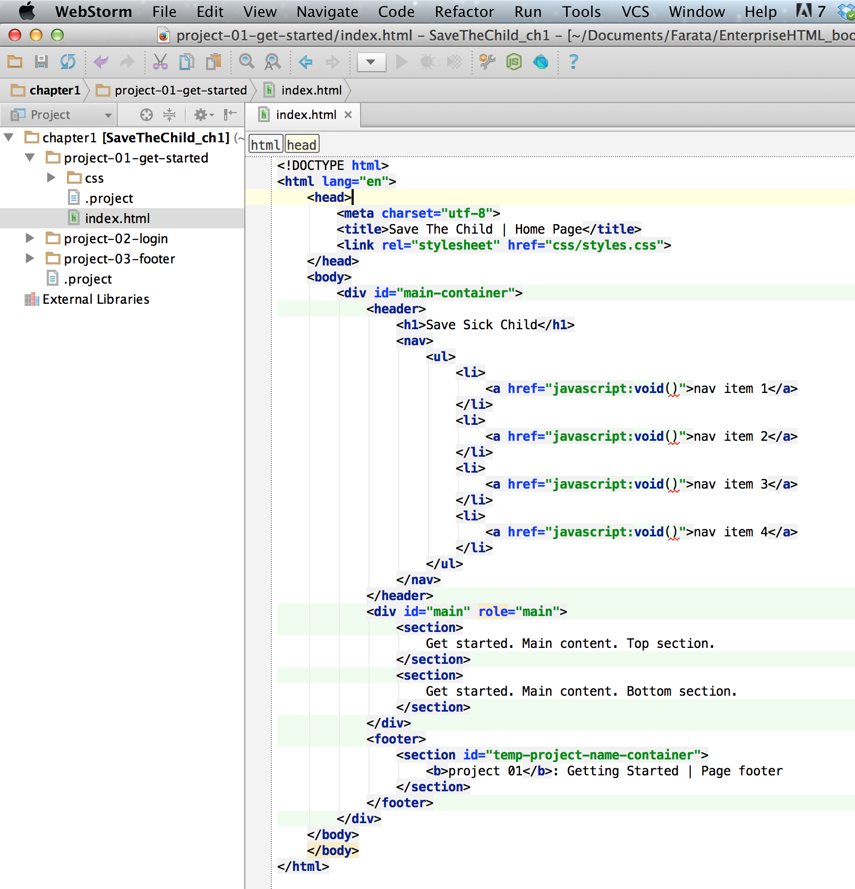

[[appendix_c]]
[appendix]

== Appendix C. Running Code Samples and IDE 

The code samples used in this book are available on https://github.com/Farata/EnterpriseWebBook_sources[Github] - they are grouped by chapters.  If a chapter has code samples, look for the directory with the respective name.  

Technically, you don't have to use any Integrated Development Environment (IDE) to run code examples (except the CDB example from Chapter 5) - just open the main file in a Web browser and off you go.  But using an IDE will make you more productive. 

=== Which IDE to Use

Selecting an IDE that supports JavaScript is a matter of your personal preference. Since there is no compilation stage and most of your debugging will be done using the Web browser tools, picking a text editor that supports syntax highlighting is all that most developers need. For example, there is an excellent text editor http://www.sublimetext.com[Sublime Text 2]. Among many programming languages this editor understands the keywords of HTML, CSS, and JavaScript, and it offers not only syntax highlighting, context sensitive help, and auto-complete too.

If you are coming from the Java background, the chances are that you are familiar and comfortable with Eclipse IDE. In this case install the Eclipse plugin http://eclipse.org/vjet/[VJET] for JavaScript support.

Oracle's IDE http://wiki.netbeans.org/HTML5[NetBeans 7.3] and above support HTML5 and JavaScript development. NetBeans includes JavaScript debugger that allows your code to connect to the Web browser, while debugging inside the IDE. 

If you prefer Microsoft technologies, they offer excellent JavaScript support in Visual Studio 2012.

Appcelerator offers a free Eclipse-based http://aptana.com[Aptana Studio 3 IDE]. Aptana Studio comes with embedded Web Server so you can test your JavaScript code without the need to start any additional software. 

The authors of this book like and recommend using the http://www.jetbrains.com/webstorm[IDE WebStorm] from JetBrains. In addition to smart context sensitive help, auto-complete, and syntax highlighting it offers HTML5 templates, and the code coverage feature that identifies the code fragment that haven't been tested. 

=== Running Code Samples in WebStorm IDE

WebStorm IDE is pretty intuitive to use. If you've never used it before, refer to its http://www.jetbrains.com/webstorm/quickstart/[Quick Start Guide]. 
When you first start WebStorm IDE, select the option _Open Directory_ in the Welcome screen. Then select the directory where you downloaded the samples of a specific book chapter. For example, after opening code samples from Chapter 1 the WebStorm IDE may look as follows:

[[FIGc-11]]
.Code Samples from Chapter 1 in WebStorm

If you want to create a new html or JavaScript file in WebStorm, just select the appropriate menu option under the menu File | New. For example, selecting the menu File | New | HTML File will create the following file with the basic markup:

[source, html]
====
<!DOCTYPE html>
<html>
  <head>
    <title></title>
  </head>

  <body>

  </body>
</html>
====

WebStorm IDE comes with a simple http://blog.jetbrains.com/webide/2013/03/built-in-server-in-webstorm-6/[internal Web server]. Right-click on the HTML file you want to open (e.g. index.html) and select the menu Open in Browser. WebStorm's internal server will serve the file to the browser. 

For example, if the WebStorm's opened directory chapter1 as in Figure <<FIGc-11>> you'll see the following URL in your Web browser: _http://localhost:63342/chapter1/project-01-get-started_.

TIP: You can configure in WebStorm the port number of the internal Web Server via  Preferences | Debugger | JavaScript | Built-in server port.

=== Using two IDEs: WebStorm and Eclipse 

Although we prefer using WebStorm for JavaScript development, but have to use Eclipse for some Java-related projects. In such cases we create a project in WebStorm pointing at the WebContent directory of your Eclipse project. This way we still enjoy a very smart context sensitive help offered by WebStorm, and all code modifications become immediately visible in the Eclipse project. 

To open the content of Eclipse WebContent directory in WebStorm select its menu File | Open Directory and point it at the WebContent directory of your Eclipse project. 

Mac users can also do it another way:

1. Create a script to launch WebStorm from the command line. To do this start Storm and open its menu Tools | Create Launcher Script. Agree with defaults offered by the popup window shown in <<FIG6-4-SSC>> or select other directory located in the PATH system variable of your computer. This will create a script named wstorm there, and you'll be able to start WebStorm from a command line.
+
[[FIG6-4-SSC]]
.Creating the launch script for WebStorm 
image::images/fig_06_04_SSC.png[image]
+
2. Open a Terminal window and switch to the directory WebStorm of your Eclipse project. Type there the command _wstorm ._, and it'll open the WebStorm with the entire content of your WebContent project. So all JavaScript development you'll be doing in WebStorm, and the Java-related coding in Eclipse while using the same WebContent directory. 

Such complex setup looks like an overkill, but we are talking about the enterprise development where you may jump through some hoops to create a convenient working environment for yourself. Besides, you do it only once.
