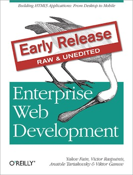

:toc!:

= Enterprise Web Development: From Desktop to Mobile

[.th.large-4.columns]

[role="large-8 columns"]
This is a home of the upcoming book «Enterprise Web Development. From Desktop to Mobile». The authors of this book are Yakov Fain, Victor Rasputnis, Viktor Gamov, and Anatole Tartakovsky. They all work at http://www.faratasystems.com[Farata Systems], a leading IT consulting and product company specializing in the area of the Enterprise Web and mobile applications.

[role="large-8 columns"]
This book will be printed in the Summer of 2013, but you can [line-through]*enjoy* read the current manuscript enterprisewebbook.com. The sources of this book are located at https://github.com/Farata/EnterpriseWebBook[Github].

[role="large-8 columns"]
The book is released under a Creative Commons Attribution-NonCommercial-ShareAlike 3.0 Unported http://creativecommons.org/licenses/by-nc-sa/3.0/[license] meaning you can both get a copy of the book for free or help to further improve it. This book will be printed and available for purchase via http://oreilly.com[O’Reilly Media]. Readers will have an option of purchasing this book in a number of digital formats.

++++

<a class="small button" href="http://shop.oreilly.com/product/0636920028314.do?&code=WKERLSE">Buy Early Release with discount at O'Reilly</a>
<a class="small button success radius" href="#book_start">Or continue reading online for free!</a>

++++

[role="row large-12 columns"]
include::buttons.adoc[]

include::toc.adoc[]

include::stat.adoc[]